# Siege by Trebuchet - Technical Architecture Plan

## Executive Summary

"Siege by Trebuchet" is a physics-driven mobile puzzle game targeting iOS and Android platforms. The game features realistic projectile physics, structural destruction mechanics, and a progression system across themed regions. This document outlines the complete technical architecture, technology stack, and implementation roadmap.

---

## 1. Technology Stack Recommendations

### 1.1 Game Engine Selection

**Recommended: Unity 2022 LTS or later**

**Rationale:**
- Cross-platform support for iOS and Android from a single codebase
- Mature 2D physics engine (Box2D) and 3D physics (PhysX) options
- Extensive asset store for UI, audio, and visual effects
- Strong community support and documentation
- Built-in monetization and analytics integrations
- Excellent mobile optimization tools

**Alternative: Godot 4.x**
- Lightweight, open-source option
- Good 2D physics integration
- Smaller build sizes
- Steeper learning curve for mobile deployment

### 1.2 Core Technologies

| Component | Technology | Justification |
|-----------|-----------|---------------|
| **Physics Engine** | Unity 2D Physics (Box2D) | Proven stability, good performance on mobile, supports structural destruction |
| **Trajectory Prediction** | Custom implementation using Unity Physics | Precise control for ghost arc visualization |
| **Data Serialization** | JSON + BinaryFormatter for saves | Human-readable for configs, efficient for save data |
| **Analytics** | Unity Analytics or Firebase | Cross-platform, free tier available |
| **Ads** | Unity Ads or IronSource | Easy integration, good fill rates |
| **IAP** | Unity In-App Purchasing | Cross-platform wrapper for native stores |

### 1.3 Development Tools

- **Version Control:** Git with GitHub/GitLab
- **Project Management:** Jira, Trello, or GitHub Projects
- **CI/CD:** GitHub Actions or Unity Cloud Build
- **Asset Management:** Unity Addressables for dynamic loading
- **Testing:** Unity Test Framework, NUnit

---

## 2. Project Structure

```
castle-attack/
├── Assets/
│   ├── Scripts/
│   │   ├── Core/
│   │   │   ├── GameManager.cs
│   │   │   ├── SaveManager.cs
│   │   │   └── EventManager.cs
│   │   ├── Physics/
│   │   │   ├── TrajectoryPredictor.cs
│   │   │   ├── DestructionManager.cs
│   │   │   └── MaterialProperties.cs
│   │   ├── Trebuchet/
│   │   │   ├── TrebuchetController.cs
│   │   │   ├── TrebuchetParameters.cs
│   │   │   └── ProjectileSpawner.cs
│   │   ├── Castle/
│   │   │   ├── CastleBuilder.cs
│   │   │   ├── StructureComponent.cs
│   │   │   ├── MaterialType.cs
│   │   │   └── WeakPointSystem.cs
│   │   ├── Ammunition/
│   │   │   ├── AmmunitionType.cs
│   │   │   ├── Projectile.cs
│   │   │   ├── FirePotEffect.cs
│   │   │   ├── PlagueBarrelEffect.cs
│   │   │   └── ChainShotEffect.cs
│   │   ├── Level/
│   │   │   ├── LevelManager.cs
│   │   │   ├── LevelData.cs
│   │   │   ├── LevelGoal.cs
│   │   │   ├── EnvironmentVariables.cs
│   │   │   └── LevelLoader.cs
│   │   ├── Progression/
│   │   │   ├── WorldMapManager.cs
│   │   │   ├── StarRatingSystem.cs
│   │   │   ├── UnlockManager.cs
│   │   │   └── ChallengeMode.cs
│   │   ├── UI/
│   │   │   ├── TouchControls.cs
│   │   │   ├── CameraController.cs
│   │   │   ├── HUDController.cs
│   │   │   ├── AimAssistToggle.cs
│   │   │   └── ParameterSliders.cs
│   │   ├── Audio/
│   │   │   ├── AudioManager.cs
│   │   │   ├── SoundLibrary.cs
│   │   │   └── ImpactSoundScaler.cs
│   │   ├── VisualEffects/
│   │   │   ├── DestructionEffects.cs
│   │   │   ├── ParticleManager.cs
│   │   │   └── GhostArcRenderer.cs
│   │   └── Monetization/
│   │       ├── CosmeticManager.cs
│   │       ├── HintSystem.cs
│   │       ├── LevelPackManager.cs
│   │       └── AdManager.cs
│   ├── Prefabs/
│   │   ├── Trebuchet/
│   │   ├── CastleComponents/
│   │   ├── Projectiles/
│   │   └── UI/
│   ├── Materials/
│   │   ├── Wood/
│   │   ├── Stone/
│   │   └── Effects/
│   ├── Audio/
│   │   ├── SFX/
│   │   └── Music/
│   ├── Sprites/
│   │   ├── Castle/
│   │   ├── Trebuchet/
│   │   ├── UI/
│   │   └── Backgrounds/
│   ├── ScriptableObjects/
│   │   ├── AmmunitionTypes/
│   │   ├── MaterialProperties/
│   │   ├── LevelData/
│   │   └── Unlockables/
│   ├── Scenes/
│   │   ├── Boot.unity
│   │   ├── MainMenu.unity
│   │   ├── WorldMap.unity
│   │   ├── LevelSelect.unity
│   │   ├── Game.unity
│   │   ├── Victory.unity
│   │   ├── Defeat.unity
│   │   └── Shop.unity
│   ├── Resources/
│   │   ├── Addressables/
│   │   └── Data/
│   └── Plugins/
├── ProjectSettings/
├── Packages/
├── UserSettings/
├── Documentation/
│   ├── DesignDocs/
│   ├── APIReference/
│   └── LevelDesignGuide.md
├── Tests/
│   ├── PlayMode/
│   └── EditMode/
└── BuildScripts/
```

---

## 3. Core System Architectures

### 3.1 Physics System Architecture

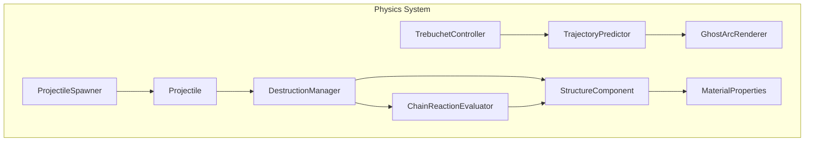

**Key Components:**

1. **TrajectoryPredictor**
   - Simulates projectile path using current trebuchet parameters
   - Accounts for gravity, wind, and environmental factors
   - Returns array of Vector3 points for visualization
   - Supports disabling for hard mode

2. **DestructionManager**
   - Monitors collision events between projectiles and structures
   - Calculates damage based on projectile mass, velocity, and material
   - Triggers structural integrity checks
   - Manages particle effects and debris spawning

3. **MaterialProperties (ScriptableObject)**
   ```csharp
   public class MaterialProperties : ScriptableObject
   {
       public MaterialType type;
       public float baseHealth;
       public float density;
       public float friction;
       public float bounciness;
       public bool isFlammable;
       public float burnDamageRate;
       public Color materialColor;
       public AudioClip[] breakSounds;
   }
   ```

4. **StructureComponent**
   - Attached to every castle component
   - Tracks current health and structural integrity
   - Notifies DestructionManager when destroyed
   - Supports weak point marking

5. **ChainReactionEvaluator**
   - Analyzes structural dependencies after destruction
   - Calculates if removal of component causes collapse
   - Triggers cascading destruction with visual feedback

### 3.2 Trebuchet System Architecture

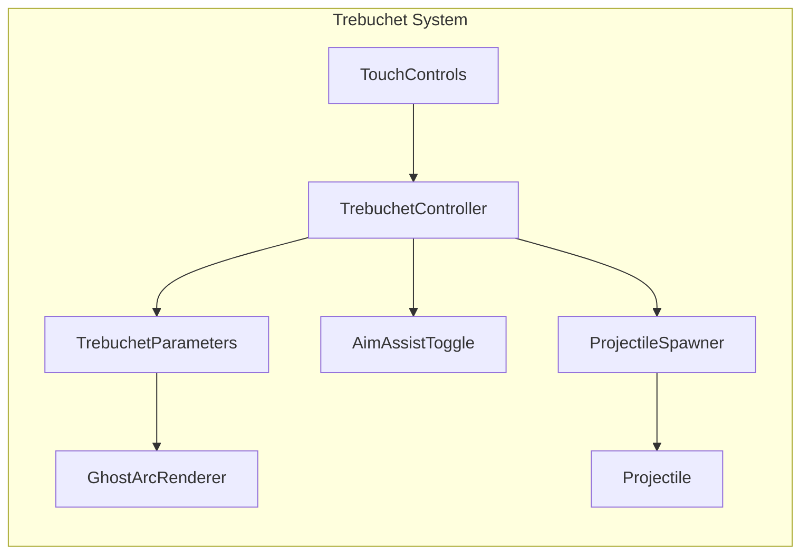

**TrebuchetParameters Data Model:**
```csharp
[Serializable]
public class TrebuchetParameters
{
    [Range(0f, 100f)] public float armPullbackStrength;
    [Range(0f, 90f)] public float releaseAngle;
    [Range(10f, 100f)] public float counterweightMass;
    [Range(1f, 5f)] public float slingLength;
    
    // Runtime calculated values
    public float launchVelocity;
    public Vector3 launchDirection;
    
    public void CalculateLaunchPhysics()
    {
        // Physics calculation based on trebuchet mechanics
        // F = ma, torque calculations, etc.
    }
}
```

**TrebuchetController Responsibilities:**
- Handle touch input for arm pullback (drag backward)
- Handle swipe gestures for angle adjustment
- Update parameters in real-time
- Trigger fire on tap
- Animate trebuchet arm release
- Apply cosmetic skins

### 3.3 Castle System Architecture

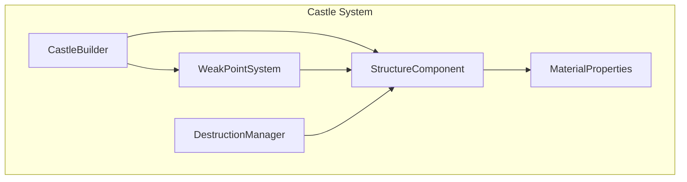

**CastleBuilder:**
- Instantiates castle structures from level data
- Applies material properties to components
- Establishes structural joints and constraints
- Marks weak points for visual indication
- Supports procedural generation for challenge modes

**StructureComponent:**
```csharp
public class StructureComponent : MonoBehaviour, IDamageable
{
    public MaterialType materialType;
    public float currentHealth;
    public float maxHealth;
    public List<Joint2D> connectedJoints;
    public List<StructureComponent> dependentStructures;
    public bool isWeakPoint;
    public bool isKeep;
    public bool isTargetBanner;
    
    public void TakeDamage(float damage, DamageType type);
    public void ApplyEnvironmentalEffect(EnvironmentEffect effect);
    public void OnDestroyed();
}
```

**WeakPointSystem:**
- Identifies critical structural points
- Applies visual indicators (cracks, stress marks)
- Multiplies damage at weak points
- Rewards precision hits

### 3.4 Level Management Architecture

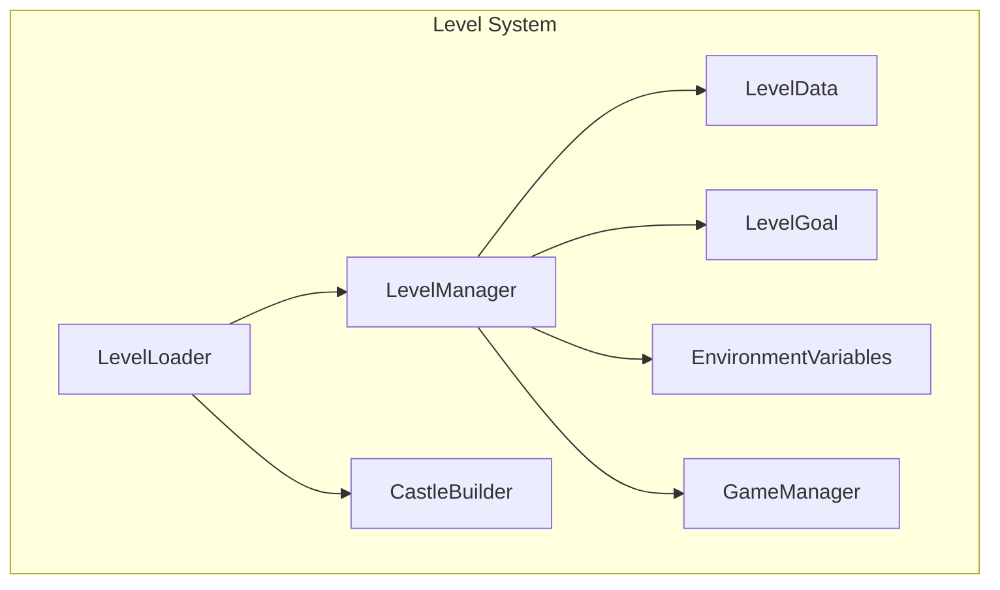

**LevelData (ScriptableObject):**
```csharp
[CreateAssetMenu(fileName = "NewLevel", menuName = "Siege/Level Data")]
public class LevelData : ScriptableObject
{
    public string levelId;
    public string levelName;
    public int regionIndex;
    public int levelIndex;
    public LevelGoalType goalType;
    public List<StructureBlueprint> castleBlueprints;
    public EnvironmentVariables environment;
    public List<AmmunitionAllocation> ammunition;
    public int maxShots;
    public int starThresholds; // [1-star, 2-star, 3-star]
    public bool trajectoryPreviewEnabled;
    public bool isChallengeLevel;
}
```

**LevelGoal Types:**
- DestroyKeep: Eliminate the main castle keep
- EliminateBanner: Destroy specific target banner
- CollapseStructure: Bring down designated structure
- DefeatDefenders: Indirect elimination via destruction

**EnvironmentVariables:**
```csharp
[Serializable]
public class EnvironmentVariables
{
    public Vector2 windDirection;
    public float windStrength;
    public float elevationModifier;
    public List<ObstacleData> obstacles;
    public BackgroundTheme backgroundTheme;
}
```

---

## 4. Data Models

### 4.1 Ammunition Types

```csharp
public enum AmmunitionType
{
    Stone,
    FirePot,
    PlagueBarrel,
    ChainShot,
    RoyalBoulder
}

[CreateAssetMenu(fileName = "Ammo", menuName = "Siege/Ammunition")]
public class AmmunitionData : ScriptableObject
{
    public AmmunitionType type;
    public string displayName;
    public float mass;
    public float baseDamage;
    public float radius;
    public int unlockLevel;
    public bool isRare;
    public GameObject projectilePrefab;
    public AudioClip fireSound;
    public AudioClip impactSound;
    
    // Special effects
    public bool hasSecondaryEffect;
    public float effectDuration;
    public float effectRadius;
}
```

### 4.2 Material Properties

```csharp
public enum MaterialType
{
    Wood,
    Stone,
    ReinforcedStone,
    Iron
}

[CreateAssetMenu(fileName = "Material", menuName = "Siege/Material")]
public class MaterialData : ScriptableObject
{
    public MaterialType type;
    public float health;
    public float density;
    public float friction;
    public float bounciness;
    public bool isFlammable;
    public float burnDamagePerSecond;
    public Color normalColor;
    public Color damagedColor;
    public ParticleSystem destructionParticles;
    public AudioClip[] destructionSounds;
}
```

### 4.3 Structure Components

```csharp
[Serializable]
public class StructureBlueprint
{
    public string componentId;
    public Vector2 position;
    public float rotation;
    public Vector2 scale;
    public MaterialType materialType;
    public bool isKeep;
    public bool isTargetBanner;
    public bool isWeakPoint;
    public List<string> connectedTo; // IDs of connected components
}
```

### 4.4 Progression Data

```csharp
[Serializable]
public class PlayerProgress
{
    public int currentRegion;
    public List<LevelCompletion> completedLevels;
    public List<AmmunitionType> unlockedAmmo;
    public List<TrebuchetUpgrade> unlockedUpgrades;
    public List<string> ownedCosmetics;
    public string equippedCosmetic;
    public int totalStars;
    public int currency;
    public DateTime lastPlayTime;
}

[Serializable]
public class LevelCompletion
{
    public string levelId;
    public int stars;
    public int shotsUsed;
    public bool isCompleted;
    public DateTime completionTime;
}
```

---

## 5. Progression System Architecture

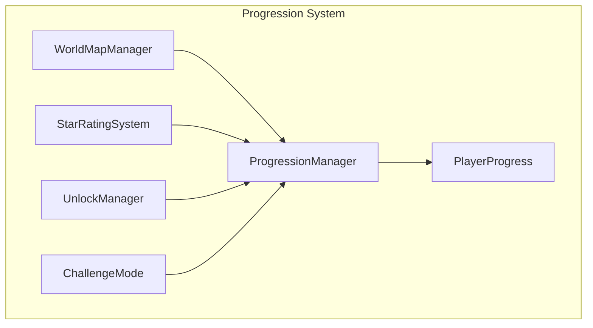

**WorldMapManager:**
- Renders themed regions (Plains, Mountains, Coastal Forts)
- Shows level locks based on progression
- Displays star ratings per level
- Handles region unlocking

**StarRatingSystem:**
- Calculates stars based on efficiency metrics
- Metrics: shots used, time taken, accuracy
- Awards bonus stars for chain reactions
- Stores per-level best performance

**UnlockManager:**
- Manages ammunition unlocks
- Manages trebuchet upgrade unlocks
- Validates unlock conditions
- Shows unlock progress in UI

**ChallengeMode:**
- Restricted ammo challenges
- No trajectory preview mode
- Time-attack variants
- Special reward structure

---

## 6. UI/UX Architecture for Mobile Controls

### 6.1 Control Scheme

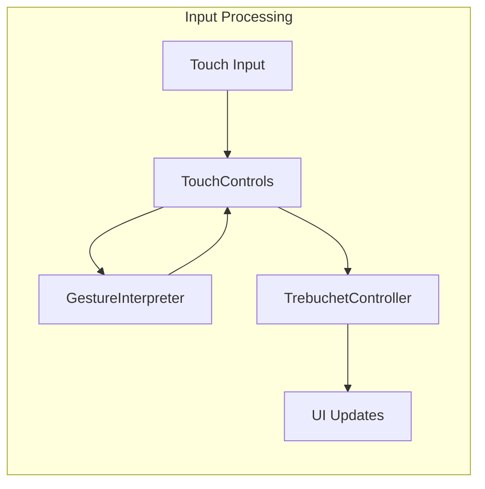

**TouchControls Implementation:**

| Action | Input Method | Visual Feedback |
|--------|--------------|-----------------|
| Set Power | Drag arm backward | Arm animates, power bar fills |
| Set Angle | Swipe up/down | Angle indicator updates |
| Fire | Tap anywhere | Release animation, camera follows projectile |
| Zoom | Pinch | Camera zooms in/out |
| Pan | One-finger drag | Camera pans battlefield |
| Fine-tune | Slider (optional) | Numeric value display |

**Key Design Principles:**
- Large touch targets (minimum 44x44 points)
- Deliberate pacing - no rapid inputs required
- Clear visual feedback for all interactions
- One-hand operation support
- Haptic feedback on fire and impact

### 6.2 Camera Controller

```csharp
public class CameraController : MonoBehaviour
{
    public float minZoom = 0.5f;
    public float maxZoom = 2f;
    public float panSpeed = 1f;
    public float zoomSpeed = 0.1f;
    
    public void FollowProjectile(Projectile projectile);
    public void ReturnToTrebuchet();
    public void PanTo(Vector2 target);
    public void Zoom(float delta);
}
```

### 6.3 HUD Components

- **Ammunition Selector:** Shows available ammo types and quantities
- **Parameter Display:** Current power, angle, counterweight
- **Shot Counter:** Shots used / shots available
- **Goal Indicator:** Shows current objective
- **Star Progress:** Real-time efficiency rating
- **Pause/Settings Menu:** Accessible during gameplay

---

## 7. Asset Pipeline and Resource Management

### 7.1 Addressables System

**Use Unity Addressables for:**
- Level data bundles
- Region-specific assets
- Cosmetic trebuchet skins
- Audio packs
- Large texture atlases

**Benefits:**
- Reduced initial build size
- On-demand loading
- Easy content updates without app store approval
- Memory management

### 7.2 Asset Organization

**Sprite Atlases:**
- Per-region castle components
- Trebuchet animations
- UI elements
- Particle textures

**Audio Bundles:**
- SFX by category (impact, destruction, UI)
- Music per region
- Ambient sounds

### 7.3 Resource Loading Strategy

```csharp
public class AssetManager : MonoBehaviour
{
    public async Task<GameObject> LoadPrefab(string key);
    public async Task<AudioClip> LoadAudio(string key);
    public async Task<Sprite> LoadSprite(string key);
    public void UnloadUnusedAssets();
}
```

---

## 8. Audio System Architecture

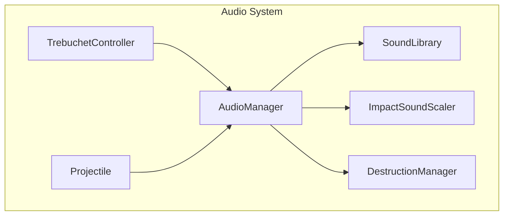

**AudioManager Features:**
- Pool audio sources for performance
- Dynamic mixing based on game state
- Music fades during aiming
- Spatial audio for 3D positioning
- Volume controls for SFX/Music

**ImpactSoundScaler:**
- Adjusts impact sound based on projectile mass and velocity
- Layers multiple sounds for heavy impacts
- Randomizes pitch for variety

**Sound Library Categories:**
- Trebuchet: creak, release, reload
- Destruction: wood crack, stone fracture, metal clang
- Impacts: thud, crash, boom
- UI: button clicks, sliders, notifications
- Music: ambient medieval themes

---

## 9. Visual Effects Architecture

### 9.1 Destruction Effects

```csharp
public class DestructionEffects : MonoBehaviour
{
    public ParticleSystem woodDebris;
    public ParticleSystem stoneDebris;
    public ParticleSystem dustCloud;
    public ParticleSystem fireEffect;
    public ParticleSystem plagueEffect;
    
    public void PlayDestructionEffect(Vector3 position, MaterialType material);
    public void PlayChainReactionEffect(List<Vector3> positions);
}
```

### 9.2 Ghost Arc Renderer

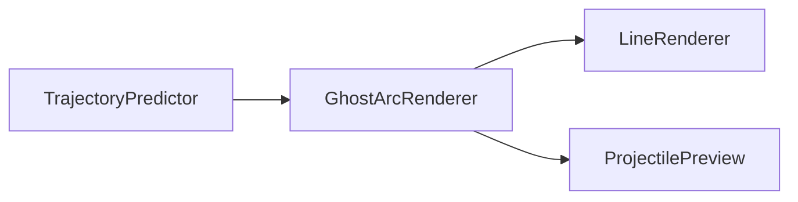

**GhostArcRenderer:**
- Draws predicted trajectory line
- Shows projectile preview at impact point
- Updates in real-time as parameters change
- Can be toggled on/off
- Color-coded for hit/miss prediction

### 9.3 Particle Management

- Object pooling for particles
- LOD system for mobile performance
- Particle culling based on camera view
- Performance budgets per scene

---

## 10. Monetization Architecture

### 10.1 Cosmetic System

```csharp
public class CosmeticManager : MonoBehaviour
{
    public List<TrebuchetSkin> availableSkins;
    public List<string> ownedSkins;
    public string equippedSkin;
    
    public void PurchaseSkin(string skinId);
    public void EquipSkin(string skinId);
    public bool IsSkinOwned(string skinId);
}
```

### 10.2 Hint System

```csharp
public class HintSystem : MonoBehaviour
{
    public int freeHintsPerLevel;
    public int hintsUsed;
    
    public void ShowHint();
    public bool HasFreeHints();
    public void PurchaseHint();
}
```

### 10.3 Level Pack System

```csharp
public class LevelPackManager : MonoBehaviour
{
    public List<LevelPack> availablePacks;
    public List<string> ownedPacks;
    
    public void PurchasePack(string packId);
    public bool IsPackOwned(string packId);
}
```

### 10.4 Ad Integration

**Ad Placement Strategy:**
- Interstitial ads between levels (optional)
- Rewarded ads for extra hints or ammunition
- Never show ads mid-attempt
- Respect user's ad preference setting

---

## 11. Accessibility Features

### 11.1 Colorblind Support

- Material indicators use patterns + colors
- Optional high-contrast mode
- Customizable color schemes

### 11.2 Text Size

- Scalable UI text
- Minimum readable size enforcement
- System font size integration

### 11.3 Simplified Physics Mode

- Reduced wind effects
- More forgiving trajectory
- Visual aim assist enhancements

### 11.4 One-Hand Play

- Controls positioned for thumb reach
- Landscape orientation option
- Gesture alternatives for all actions

---

## 12. Save System Architecture

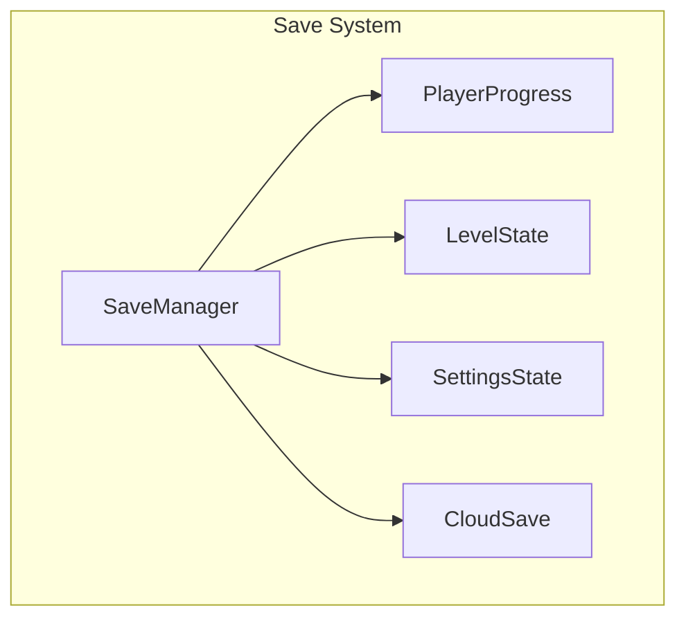

**SaveManager Implementation:**
```csharp
public class SaveManager : MonoBehaviour
{
    private const string SAVE_KEY = "Siege_SaveData";
    private PlayerProgress saveData;
    
    public void SaveGame();
    public void LoadGame();
    public void DeleteSave();
    public void ResetProgress();
    public bool HasSaveData();
    
    // Auto-save triggers
    public void OnLevelComplete(string levelId, int stars);
    public void OnUnlock(string unlockableId);
}
```

**Save Data Structure:**
- Player progress (unlocks, stars, currency)
- Current level state (for pause/resume)
- Settings (audio, graphics, accessibility)
- Timestamps for analytics

---

## 13. Implementation Roadmap

### Phase 1: Foundation (Weeks 1-4)

**Week 1: Project Setup**
- [ ] Initialize Unity project with appropriate settings
- [ ] Set up version control and project structure
- [ ] Configure build settings for iOS and Android
- [ ] Create base scene architecture (Boot, MainMenu, Game)
- [ ] Set up Addressables system

**Week 2: Core Physics**
- [ ] Implement TrajectoryPredictor
- [ ] Create GhostArcRenderer
- [ ] Set up basic 2D physics environment
- [ ] Implement MaterialProperties ScriptableObjects
- [ ] Create basic StructureComponent

**Week 3: Trebuchet Prototype**
- [ ] Build TrebuchetController
- [ ] Implement touch controls (drag, swipe, tap)
- [ ] Create TrebuchetParameters data model
- [ ] Animate trebuchet arm
- [ ] Implement projectile spawning

**Week 4: Basic Destruction**
- [ ] Implement DestructionManager
- [ ] Create damage calculation system
- [ ] Add basic particle effects
- [ ] Implement ChainReactionEvaluator
- [ ] Create weak point system

### Phase 2: Core Gameplay (Weeks 5-8)

**Week 5: Castle Building**
- [ ] Create CastleBuilder system
- [ ] Implement StructureBlueprint data model
- [ ] Build modular castle components
- [ ] Create material-specific prefabs
- [ ] Implement structural joints

**Week 6: Ammunition System**
- [ ] Create AmmunitionData ScriptableObjects
- [ ] Implement all ammo types (Stone, FirePot, PlagueBarrel, ChainShot, RoyalBoulder)
- [ ] Create special effect systems
- [ ] Implement ammunition selector UI
- [ ] Add ammunition limits per level

**Week 7: Level Management**
- [ ] Create LevelData ScriptableObjects
- [ ] Implement LevelManager
- [ ] Create LevelGoal system
- [ ] Implement EnvironmentVariables
- [ ] Build LevelLoader

**Week 8: Camera & UI**
- [ ] Implement CameraController
- [ ] Create HUD system
- [ ] Build touch controls UI
- [ ] Implement parameter sliders
- [ ] Add pause menu

### Phase 3: Progression & Content (Weeks 9-12)

**Week 9: Progression System**
- [ ] Implement PlayerProgress save system
- [ ] Create WorldMapManager
- [ ] Implement StarRatingSystem
- [ ] Build UnlockManager
- [ ] Create ChallengeMode

**Week 10: Content Creation**
- [ ] Design and build Plains region levels (1-10)
- [ ] Create region-specific backgrounds
- [ ] Build level variety (different goals, environments)
- [ ] Balance difficulty curve
- [ ] Create level completion screens

**Week 11: Audio & Polish**
- [ ] Implement AudioManager
- [ ] Create sound library
- [ ] Add impact sound scaling
- [ ] Implement music system with fade
- [ ] Add haptic feedback

**Week 12: Visual Effects**
- [ ] Enhance destruction particles
- [ ] Create dust and debris effects
- [ ] Implement fire and plague visual effects
- [ ] Add screen shake on impacts
- [ ] Polish ghost arc visualization

### Phase 4: Advanced Features (Weeks 13-16)

**Week 13: Advanced Trebuchet**
- [ ] Implement counterweight mass adjustment
- [ ] Add sling length parameter
- [ ] Create trebuchet upgrade system
- [ ] Build upgrade UI
- [ ] Balance upgrade impact on gameplay

**Week 14: Monetization**
- [ ] Implement CosmeticManager
- [ ] Create hint system
- [ ] Build level pack system
- [ ] Integrate ad system
- [ ] Create shop UI

**Week 15: Additional Regions**
- [ ] Design Mountains region levels (11-20)
- [ ] Design Coastal Forts region levels (21-30)
- [ ] Create region-specific assets
- [ ] Implement elevation mechanics
- [ ] Add water/moat obstacles

**Week 16: Accessibility & Settings**
- [ ] Implement colorblind mode
- [ ] Add text size scaling
- [ ] Create simplified physics mode
- [ ] Build settings menu
- [ ] Add one-hand play optimizations

### Phase 5: Testing & Optimization (Weeks 17-20)

**Week 17: Core Testing**
- [ ] Write unit tests for physics calculations
- [ ] Write integration tests for level loading
- [ ] Create automated playthrough tests
- [ ] Performance profiling on target devices
- [ ] Memory leak detection

**Week 18: Device Testing**
- [ ] Test on various iOS devices
- [ ] Test on various Android devices
- [ ] Optimize for low-end devices
- [ ] Test different screen sizes and aspect ratios
- [ ] Verify one-hand play on phones

**Week 19: Optimization**
- [ ] Implement object pooling for projectiles
- [ ] Optimize particle systems
- [ ] Reduce draw calls
- [ ] Implement texture compression
- [ ] Optimize physics calculations

**Week 20: Polish & Bug Fixes**
- [ ] Fix reported bugs
- [ ] Balance difficulty across all levels
- [ ] Polish UI transitions
- [ ] Add tutorial system
- [ ] Final performance tuning

### Phase 6: Launch Preparation (Weeks 21-24)

**Week 21: Analytics & Integration**
- [ ] Integrate analytics SDK
- [ ] Set up event tracking
- [ ] Implement crash reporting
- [ ] Configure IAP testing
- [ ] Set up ad mediation

**Week 22: Store Preparation**
- [ ] Create app store assets (screenshots, icons)
- [ ] Write app descriptions
- [ ] Create promotional materials
- [ ] Set up app store listings
- [ ] Configure age ratings

**Week 23: Beta Testing**
- [ ] Distribute beta to testers
- [ ] Collect feedback
- [ ] Address critical issues
- [ ] Balance based on feedback
- [ ] Prepare launch build

**Week 24: Launch**
- [ ] Submit to App Store
- [ ] Submit to Google Play
- [ ] Prepare launch marketing
- [ ] Monitor initial downloads
- [ ] Address immediate issues

---

## 14. Technical Considerations & Trade-offs

### 14.1 Physics Engine Choice

**Decision: Unity 2D Physics (Box2D)**

**Pros:**
- Stable and well-tested
- Good performance on mobile
- Easy to debug
- Built-in to Unity

**Cons:**
- Limited to 2D (game is 2D anyway)
- Less realistic than 3D physics
- Chain reactions may require custom logic

**Alternative Considered: Custom 3D Physics**
- More realistic but heavier performance cost
- Overkill for 2D gameplay
- Harder to balance

### 14.2 Trajectory Prediction

**Decision: Real-time simulation with discrete time steps**

**Approach:**
- Simulate physics frame-by-frame for prediction
- Use same physics parameters as actual projectile
- Cache results to avoid recalculating every frame
- Limit prediction distance for performance

**Trade-off:**
- Slight performance cost during aiming
- More accurate than analytical approximation
- Accounts for all physics interactions

### 14.3 Save System

**Decision: Local JSON + Cloud Backup**

**Approach:**
- Primary save: Local JSON file
- Backup: Cloud sync (Game Center / Google Play Games)
- Auto-save after level completion
- Manual save option in settings

**Trade-off:**
- JSON is human-readable (good for debugging)
- Larger file size than binary
- Cloud sync requires platform-specific APIs

### 14.4 Asset Loading

**Decision: Addressables with local bundles**

**Approach:**
- Core assets in build
- Optional content as Addressables
- Download on demand for level packs
- Cache locally after download

**Trade-off:**
- Initial setup complexity
- Better for content updates
- Reduced initial download size

### 14.5 Monetization Balance

**Decision: Non-intrusive, cosmetic-focused**

**Approach:**
- No pay-to-win mechanics
- Cosmetics only for trebuchet
- Optional hints (can be earned)
- Optional level packs
- Ads are completely optional

**Trade-off:**
- Lower revenue potential
- Better player experience
- Higher retention expected

---

## 15. Performance Targets

### 15.1 Frame Rate

- **Target:** 60 FPS on mid-range devices
- **Minimum:** 30 FPS on low-end devices
- **Test Devices:** iPhone 8, Samsung Galaxy S8

### 15.2 Memory

- **Target:** < 150 MB RAM during gameplay
- **Texture Budget:** 50 MB compressed
- **Audio Budget:** 20 MB
- **Other Assets:** 80 MB

### 15.3 Build Size

- **Initial Download:** < 100 MB
- **After Content Updates:** < 150 MB
- **Use Addressables for optional content**

### 15.4 Loading Times

- **Initial Load:** < 3 seconds
- **Level Load:** < 1 second
- **Scene Transition:** < 0.5 seconds

---

## 16. Testing Strategy

### 16.1 Unit Tests

- Physics calculations
- Trajectory prediction
- Damage formulas
- Save/Load operations
- Progression calculations

### 16.2 Integration Tests

- Level loading and initialization
- Complete gameplay loop
- Save system integration
- IAP integration
- Analytics event tracking

### 16.3 Play Tests

- Level difficulty balance
- Control responsiveness
- Tutorial clarity
- Progression pacing
- Monetization flow

### 16.4 Device Tests

- iOS: iPhone 8, XR, 12, 14, iPad
- Android: Various manufacturers and OS versions
- Different screen sizes and aspect ratios
- Low-end and high-end devices

---

## 17. Success Metrics

### 17.1 Engagement

- **Day 1 Retention:** > 40%
- **Day 7 Retention:** > 20%
- **Day 30 Retention:** > 10%
- **Average Session Length:** 3-5 minutes
- **Levels Played Per Session:** 3-5

### 17.2 Monetization

- **Conversion Rate:** > 2%
- **ARPU:** > $0.50
- **Ad View Rate:** > 15% of users
- **Cosmetic Purchase Rate:** > 1%

### 17.3 Quality

- **Crash Rate:** < 0.5%
- **App Store Rating:** > 4.0 stars
- **Bug Reports:** < 5 per 1000 DAU
- **Loading Complaints:** < 1%

---

## 18. Risks and Mitigations

### 18.1 Technical Risks

| Risk | Impact | Mitigation |
|------|--------|------------|
| Physics performance issues on low-end devices | High | Implement LOD system, limit particle count, optimize physics calculations |
| Chain reaction unpredictability | Medium | Add visual indicators, limit cascade depth, provide undo option |
| Trajectory prediction inaccuracy | Medium | Use same physics engine for prediction, add visual margin of error |
| Memory leaks | High | Regular profiling, object pooling, proper cleanup |

### 18.2 Design Risks

| Risk | Impact | Mitigation |
|------|--------|------------|
| Levels too difficult | Medium | Extensive playtesting, multiple solution paths, hint system |
| Controls feel unresponsive | High | Early prototyping, user testing, haptic feedback |
| Monetization feels unfair | Medium | Focus on cosmetics, avoid pay-to-win, optional ads |
| Content runs out too quickly | Medium | Plan for content updates, challenge modes, user-generated levels |

### 18.3 Business Risks

| Risk | Impact | Mitigation |
|------|--------|------------|
| App store rejection | Medium | Follow guidelines carefully, test on real devices, prepare for review |
| Low discoverability | High | Marketing budget, ASO optimization, cross-promotion |
| Competitor releases similar game | Medium | Focus on unique features, polish, community building |
| Development timeline overrun | Medium | Regular milestones, scope management, feature prioritization |

---

## 19. Post-Launch Considerations

### 19.1 Content Updates

- **Monthly:** New levels (5-10)
- **Quarterly:** New region with themed content
- **Special Events:** Holiday-themed challenges
- **User Feedback:** Implement requested features

### 19.2 Live Operations

- Daily challenges
- Leaderboards
- Seasonal events
- Community features

### 19.3 Analytics Monitoring

- Track funnel metrics
- Monitor balance issues
- Identify churn points
- Measure monetization effectiveness

---

## 20. Conclusion

This architecture provides a solid foundation for "Siege by Trebuchet" that balances technical feasibility with creative vision. The phased approach allows for iterative development and early validation of core mechanics. The technology choices prioritize cross-platform compatibility, mobile performance, and maintainability.

Key strengths of this architecture:
- **Modular Design:** Each system is independent and testable
- **Scalable:** Easy to add new content and features
- **Performance-Oriented:** Built with mobile constraints in mind
- **Player-Focused:** Prioritizes accessibility and fair monetization
- **Future-Proof:** Supports content updates and platform expansions

The 24-week timeline is aggressive but achievable with a focused team and clear priorities. Regular milestones and playtesting will ensure the game stays on track and meets quality standards.

---

## Appendix A: Key ScriptableObject Templates

### A.1 AmmunitionData Template

```csharp
using UnityEngine;

[CreateAssetMenu(fileName = "NewAmmo", menuName = "Siege/Ammunition")]
public class AmmunitionData : ScriptableObject
{
    [Header("Basic Properties")]
    public AmmunitionType type;
    public string displayName;
    [TextArea] public string description;
    public Sprite icon;
    
    [Header("Physics")]
    public float mass = 10f;
    public float baseDamage = 50f;
    public float radius = 1f;
    
    [Header("Unlock")]
    public int unlockLevel = 1;
    public bool isRare = false;
    public int cost = 0;
    
    [Header("Prefabs & Audio")]
    public GameObject projectilePrefab;
    public AudioClip fireSound;
    public AudioClip impactSound;
    
    [Header("Special Effects")]
    public bool hasSecondaryEffect = false;
    public SecondaryEffectType effectType;
    public float effectDuration = 5f;
    public float effectRadius = 2f;
    public float effectDamagePerSecond = 10f;
}

public enum AmmunitionType
{
    Stone,
    FirePot,
    PlagueBarrel,
    ChainShot,
    RoyalBoulder
}

public enum SecondaryEffectType
{
    None,
    Fire,
    Plague,
    Chain
}
```

### A.2 MaterialData Template

```csharp
using UnityEngine;

[CreateAssetMenu(fileName = "NewMaterial", menuName = "Siege/Material")]
public class MaterialData : ScriptableObject
{
    [Header("Material Type")]
    public MaterialType type;
    public string materialName;
    
    [Header("Physics Properties")]
    public float health = 100f;
    public float density = 1f;
    public float friction = 0.5f;
    public float bounciness = 0.1f;
    
    [Header("Fire Properties")]
    public bool isFlammable = false;
    public float burnDamagePerSecond = 5f;
    public float spreadChance = 0.1f;
    
    [Header("Visual Properties")]
    public Color normalColor = Color.white;
    public Color damagedColor = Color.gray;
    public Sprite[] damageSprites;
    
    [Header("Effects")]
    public ParticleSystem destructionParticles;
    public AudioClip[] destructionSounds;
    
    [Header("Accessibility")]
    public Texture2D patternTexture; // For colorblind mode
}

public enum MaterialType
{
    Wood,
    Stone,
    ReinforcedStone,
    Iron
}
```

### A.3 LevelData Template

```csharp
using UnityEngine;
using System.Collections.Generic;

[CreateAssetMenu(fileName = "NewLevel", menuName = "Siege/Level Data")]
public class LevelData : ScriptableObject
{
    [Header("Level Identification")]
    public string levelId;
    public string levelName;
    [TextArea] public string levelDescription;
    public int regionIndex;
    public int levelIndex;
    
    [Header("Level Goal")]
    public LevelGoalType goalType;
    [TextArea] public string goalDescription;
    public float goalCompletionThreshold = 0.9f;
    
    [Header("Castle Configuration")]
    public List<StructureBlueprint> castleBlueprints;
    public Vector2 castlePosition;
    
    [Header("Environment")]
    public EnvironmentVariables environment;
    
    [Header("Ammunition")]
    public List<AmmunitionAllocation> ammunition;
    public int maxShots = 10;
    
    [Header("Difficulty Settings")]
    public bool trajectoryPreviewEnabled = true;
    public int starThreshold1 = 5; // Shots for 1 star
    public int starThreshold2 = 3; // Shots for 2 stars
    public int starThreshold3 = 1; // Shots for 3 stars
    
    [Header("Special Settings")]
    public bool isChallengeLevel = false;
    public bool isBonusLevel = false;
    public string requiredUnlockId;
}

[System.Serializable]
public class AmmunitionAllocation
{
    public AmmunitionType type;
    public int quantity;
}

[System.Serializable]
public class EnvironmentVariables
{
    public Vector2 windDirection = Vector2.zero;
    public float windStrength = 0f;
    public float elevationModifier = 0f;
    public List<ObstacleData> obstacles;
    public BackgroundTheme backgroundTheme;
}

[System.Serializable]
public class ObstacleData
{
    public string obstacleId;
    public Vector2 position;
    public ObstacleType type;
    public float scale = 1f;
}

public enum LevelGoalType
{
    DestroyKeep,
    EliminateBanner,
    CollapseStructure,
    DefeatDefenders
}

public enum ObstacleType
{
    Hill,
    Wall,
    Moat,
    Tree
}

public enum BackgroundTheme
{
    Plains,
    Mountains,
    Coastal,
    Desert,
    Forest
}
```

---

## Appendix B: Core Class Skeletons

### B.1 GameManager

```csharp
using UnityEngine;

public class GameManager : MonoBehaviour
{
    public static GameManager Instance { get; private set; }
    
    [Header("Game State")]
    public GameState currentState;
    public LevelData currentLevel;
    public int shotsUsed;
    public int shotsRemaining;
    
    [Header("References")]
    public TrebuchetController trebuchet;
    public LevelManager levelManager;
    public UIManager uiManager;
    
    private void Awake()
    {
        if (Instance == null)
        {
            Instance = this;
            DontDestroyOnLoad(gameObject);
        }
        else
        {
            Destroy(gameObject);
        }
    }
    
    public void StartLevel(LevelData level)
    {
        currentLevel = level;
        shotsUsed = 0;
        shotsRemaining = level.maxShots;
        currentState = GameState.Playing;
        
        levelManager.LoadLevel(level);
        uiManager.UpdateHUD();
    }
    
    public void OnProjectileFired()
    {
        shotsUsed++;
        shotsRemaining--;
        uiManager.UpdateHUD();
        
        if (shotsRemaining <= 0)
        {
            CheckLevelCompletion();
        }
    }
    
    public void OnStructureDestroyed(StructureComponent structure)
    {
        levelManager.CheckGoalCompletion();
    }
    
    public void CheckLevelCompletion()
    {
        if (levelManager.IsGoalComplete())
        {
            CompleteLevel();
        }
        else if (shotsRemaining <= 0)
        {
            FailLevel();
        }
    }
    
    private void CompleteLevel()
    {
        currentState = GameState.Victory;
        int stars = CalculateStars();
        SaveManager.Instance.OnLevelComplete(currentLevel.levelId, stars);
        uiManager.ShowVictoryScreen(stars);
    }
    
    private void FailLevel()
    {
        currentState = GameState.Defeat;
        uiManager.ShowDefeatScreen();
    }
    
    private int CalculateStars()
    {
        if (shotsUsed <= currentLevel.starThreshold3) return 3;
        if (shotsUsed <= currentLevel.starThreshold2) return 2;
        return 1;
    }
}

public enum GameState
{
    MainMenu,
    LevelSelect,
    Playing,
    Paused,
    Victory,
    Defeat
}
```

### B.2 TrebuchetController

```csharp
using UnityEngine;

public class TrebuchetController : MonoBehaviour
{
    [Header("Parameters")]
    public TrebuchetParameters parameters;
    
    [Header("Components")]
    public Transform armTransform;
    public Transform slingTransform;
    public Transform launchPoint;
    
    [Header("Visuals")]
    public LineRenderer ghostArc;
    public GameObject projectilePreview;
    
    [Header("Settings")]
    public float minPullback = 0f;
    public float maxPullback = 100f;
    public float minAngle = 0f;
    public float maxAngle = 90f;
    
    private bool isAiming = false;
    private bool ghostArcEnabled = true;
    
    private void Update()
    {
        if (isAiming)
        {
            UpdateTrajectory();
        }
    }
    
    public void SetPullback(float value)
    {
        parameters.armPullbackStrength = Mathf.Clamp(value, minPullback, maxPullback);
        parameters.CalculateLaunchPhysics();
        UpdateArmPosition();
    }
    
    public void SetAngle(float value)
    {
        parameters.releaseAngle = Mathf.Clamp(value, minAngle, maxAngle);
        parameters.CalculateLaunchPhysics();
        UpdateArmRotation();
    }
    
    public void Fire(AmmunitionData ammo)
    {
        GameObject projectile = Instantiate(ammo.projectilePrefab, launchPoint.position, Quaternion.identity);
        Projectile proj = projectile.GetComponent<Projectile>();
        proj.Initialize(parameters.launchVelocity, parameters.launchDirection, ammo);
        
        GameManager.Instance.OnProjectileFired();
        PlayFireAnimation();
    }
    
    public void ToggleGhostArc(bool enabled)
    {
        ghostArcEnabled = enabled;
        ghostArc.enabled = enabled;
        projectilePreview.SetActive(enabled);
    }
    
    private void UpdateArmPosition()
    {
        // Animate arm based on pullback
        float pullbackRatio = parameters.armPullbackStrength / maxPullback;
        armTransform.localRotation = Quaternion.Euler(0, 0, -pullbackRatio * 45f);
    }
    
    private void UpdateArmRotation()
    {
        // Adjust base rotation for angle
        transform.rotation = Quaternion.Euler(0, 0, parameters.releaseAngle);
    }
    
    private void UpdateTrajectory()
    {
        if (!ghostArcEnabled) return;
        
        Vector3[] points = TrajectoryPredictor.Predict(
            launchPoint.position,
            parameters.launchVelocity,
            parameters.launchDirection,
            GameManager.Instance.currentLevel.environment
        );
        
        ghostArc.positionCount = points.Length;
        ghostArc.SetPositions(points);
        
        // Show projectile at impact point
        projectilePreview.transform.position = points[points.Length - 1];
    }
    
    private void PlayFireAnimation()
    {
        // Trigger release animation
        StartCoroutine(FireAnimationCoroutine());
    }
    
    private System.Collections.IEnumerator FireAnimationCoroutine()
    {
        // Animate arm release
        float duration = 0.5f;
        float elapsed = 0f;
        
        Quaternion startRotation = armTransform.localRotation;
        Quaternion endRotation = Quaternion.Euler(0, 0, 45f);
        
        while (elapsed < duration)
        {
            armTransform.localRotation = Quaternion.Slerp(startRotation, endRotation, elapsed / duration);
            elapsed += Time.deltaTime;
            yield return null;
        }
        
        armTransform.localRotation = endRotation;
    }
}
```

### B.3 TrajectoryPredictor

```csharp
using UnityEngine;

public static class TrajectoryPredictor
{
    private const float TIME_STEP = 0.05f;
    private const float MAX_PREDICTION_TIME = 5f;
    
    public static Vector3[] Predict(Vector3 startPosition, float velocity, Vector3 direction, EnvironmentVariables environment)
    {
        List<Vector3> points = new List<Vector3>();
        Vector3 position = startPosition;
        Vector3 velocityVector = direction * velocity;
        
        // Apply wind
        velocityVector += environment.windDirection * environment.windStrength * 0.1f;
        
        float time = 0f;
        
        while (time < MAX_PREDICTION_TIME)
        {
            points.Add(position);
            
            // Apply gravity
            velocityVector += Physics2D.gravity * TIME_STEP;
            
            // Apply wind
            velocityVector += environment.windDirection * environment.windStrength * TIME_STEP * 0.1f;
            
            // Update position
            position += velocityVector * TIME_STEP;
            
            // Check ground collision
            if (position.y < 0f)
            {
                points.Add(position);
                break;
            }
            
            time += TIME_STEP;
        }
        
        return points.ToArray();
    }
    
    public static Vector3 PredictImpactPoint(Vector3 startPosition, float velocity, Vector3 direction, EnvironmentVariables environment)
    {
        Vector3[] points = Predict(startPosition, velocity, direction, environment);
        return points[points.Length - 1];
    }
}
```

### B.4 DestructionManager

```csharp
using UnityEngine;
using System.Collections.Generic;

public class DestructionManager : MonoBehaviour
{
    public static DestructionManager Instance { get; private set; }
    
    [Header("Effects")]
    public DestructionEffects effects;
    
    [Header("Settings")]
    public float chainReactionDelay = 0.2f;
    
    private void Awake()
    {
        if (Instance == null)
        {
            Instance = this;
        }
        else
        {
            Destroy(gameObject);
        }
    }
    
    public void OnProjectileImpact(Projectile projectile, Collider2D collision)
    {
        StructureComponent structure = collision.GetComponent<StructureComponent>();
        
        if (structure != null)
        {
            float damage = CalculateDamage(projectile, structure);
            structure.TakeDamage(damage, projectile.damageType);
            
            effects.PlayDestructionEffect(collision.transform.position, structure.materialType);
            
            // Check for chain reactions
            StartCoroutine(EvaluateChainReaction(structure));
        }
    }
    
    private float CalculateDamage(Projectile projectile, StructureComponent structure)
    {
        AmmunitionData ammo = projectile.ammoData;
        MaterialData material = GetMaterialData(structure.materialType);
        
        // Base damage
        float damage = ammo.baseDamage;
        
        // Velocity modifier
        float velocityModifier = projectile.rb.velocity.magnitude / 10f;
        damage *= velocityModifier;
        
        // Material resistance
        float materialResistance = material.density;
        damage /= materialResistance;
        
        // Weak point bonus
        if (structure.isWeakPoint)
        {
            damage *= 2f;
        }
        
        return damage;
    }
    
    private System.Collections.IEnumerator EvaluateChainReaction(StructureComponent destroyedStructure)
    {
        yield return new WaitForSeconds(chainReactionDelay);
        
        List<StructureComponent> toDestroy = new List<StructureComponent>();
        
        // Check dependent structures
        foreach (StructureComponent dependent in destroyedStructure.dependentStructures)
        {
            if (ShouldCollapse(dependent, destroyedStructure))
            {
                toDestroy.Add(dependent);
            }
        }
        
        // Destroy collapsed structures
        foreach (StructureComponent structure in toDestroy)
        {
            structure.TakeDamage(structure.maxHealth, DamageType.Structural);
            effects.PlayDestructionEffect(structure.transform.position, structure.materialType);
        }
        
        // Recursively check for more chain reactions
        foreach (StructureComponent structure in toDestroy)
        {
            yield return StartCoroutine(EvaluateChainReaction(structure));
        }
    }
    
    private bool ShouldCollapse(StructureComponent structure, StructureComponent support)
    {
        // Calculate if structure can stand without the support
        // This is a simplified check - real implementation would be more complex
        
        float supportRatio = (float)structure.connectedJoints.Count / structure.dependentStructures.Count;
        
        if (supportRatio < 0.5f)
        {
            return true;
        }
        
        // Check weight distribution
        if (structure.currentHealth < structure.maxHealth * 0.3f)
        {
            return true;
        }
        
        return false;
    }
    
    private MaterialData GetMaterialData(MaterialType type)
    {
        // Load from Resources or Addressables
        return Resources.Load<MaterialData>($"Materials/{type}");
    }
}

public enum DamageType
{
    Impact,
    Fire,
    Plague,
    Structural
}
```

---

## Appendix C: UI Flow Diagrams

### C.1 Main Menu Flow

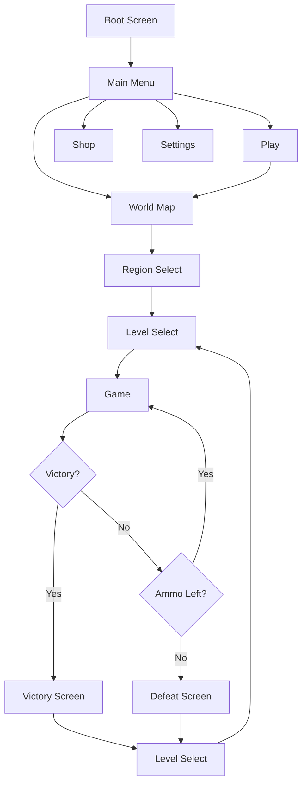

### C.2 Gameplay Flow

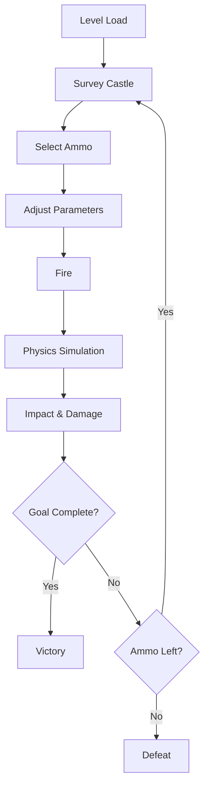

---

## Appendix D: Level Design Guidelines

### D.1 Difficulty Progression

| Region | Levels | Key Mechanics | Difficulty |
|--------|--------|---------------|------------|
| Plains | 1-10 | Basic destruction, simple structures | Easy |
| Mountains | 11-20 | Elevation, wind, complex structures | Medium |
| Coastal Forts | 21-30 | Water/moats, reinforced materials | Hard |

### D.2 Level Design Principles

1. **Multiple Solution Paths:** Each level should have at least 2-3 valid approaches
2. **Clear Feedback:** Players should understand why a shot succeeded or failed
3. **Progressive Difficulty:** Introduce new mechanics gradually
4. **Reward Creativity:** Chain reactions and clever shots should be rewarded
5. **Fair Challenge:** No pixel-perfect aiming required

### D.3 Structure Design Guidelines

- **Modular Components:** Use reusable building blocks
- **Clear Weak Points:** Visually indicate structural vulnerabilities
- **Material Variety:** Mix materials for interesting destruction
- **Weight Distribution:** Consider how structures will collapse
- **Readability:** Ensure players can understand structure at a glance

---

## Appendix E: Performance Optimization Checklist

- [ ] Object pooling for projectiles and particles
- [ ] Texture compression (ASTC for Android, PVRTC for iOS)
- [ ] Sprite atlases to reduce draw calls
- [ ] LOD system for particle effects
- [ ] Physics optimization (fixed timestep, reduced iterations)
- [ ] Audio compression (Vorbis for music, compressed for SFX)
- [ ] Garbage collection optimization (avoid allocations in Update)
- [ ] Profiling on target devices
- [ ] Memory budget tracking
- [ ] Battery usage optimization

---

## Appendix F: Localization Considerations

While the initial release may be English-only, the architecture should support:

- Text externalization to CSV/JSON
- RTL language support
- Number/date formatting
- Cultural sensitivity in visuals
- Region-specific content (holidays, events)

---

End of Architecture Plan
